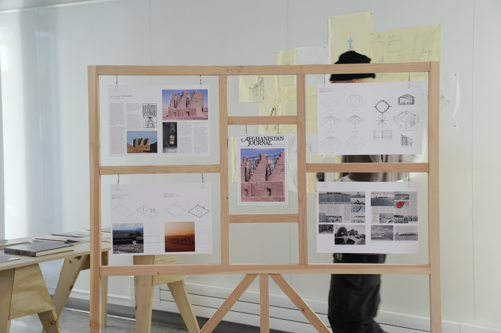

**Dec 15 2025**\
**Berkeley, CA**

Graduated from UC Berkeley with a Master’s of Design. I conducted design research regarding Afghanistan’s design and architectural history. An untapped field, I came across golden gems where the worlds of indigenous, vernacular, and traditional design and architecture revealed themselves in an utmost Afghan nature. A small fraction of this research found its way into a 38 page re-publication of Afghanistan Journal, a project published from 1974-1982 regarding a total cultural aspect of Afghanistan from the sciences, arts, anthropology, and design. More soon. 