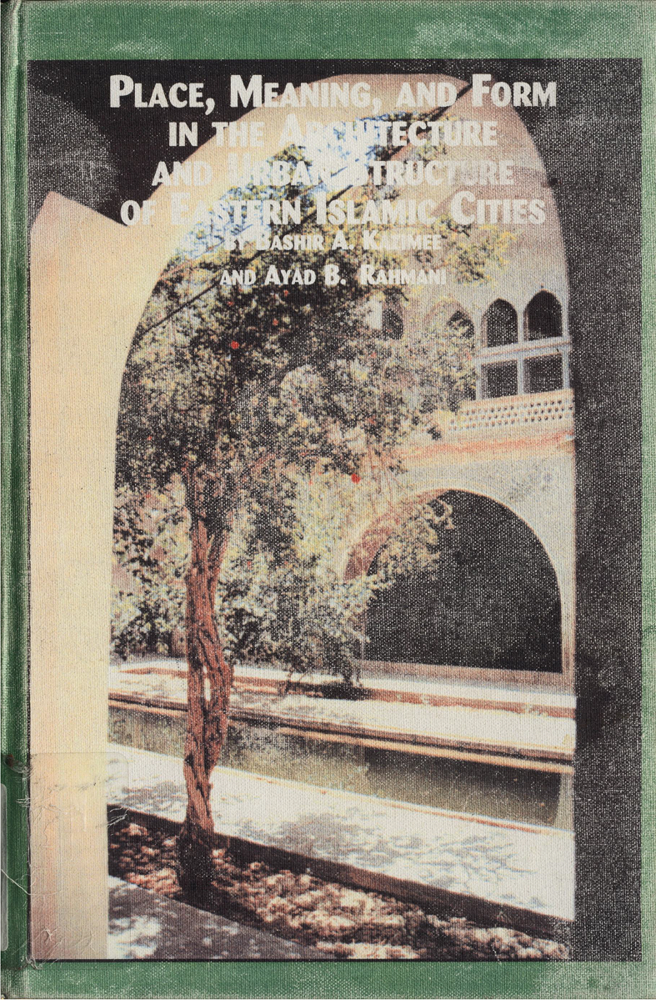

**Dec 27 2025**\
**Afghanistan**

Book review of *Place, Meaning, and Form in the Architecture and Urban Structure of Islamic Cities (2003)* by Afghan architect Bashir Kazimee and Ayad Rahimi published in the [Society of Afghan Engineers Newsletter December edition](https://www.afghanengineers.org/newsletter/sae-newsletter-2025-12-volume-16-issue-4/).
