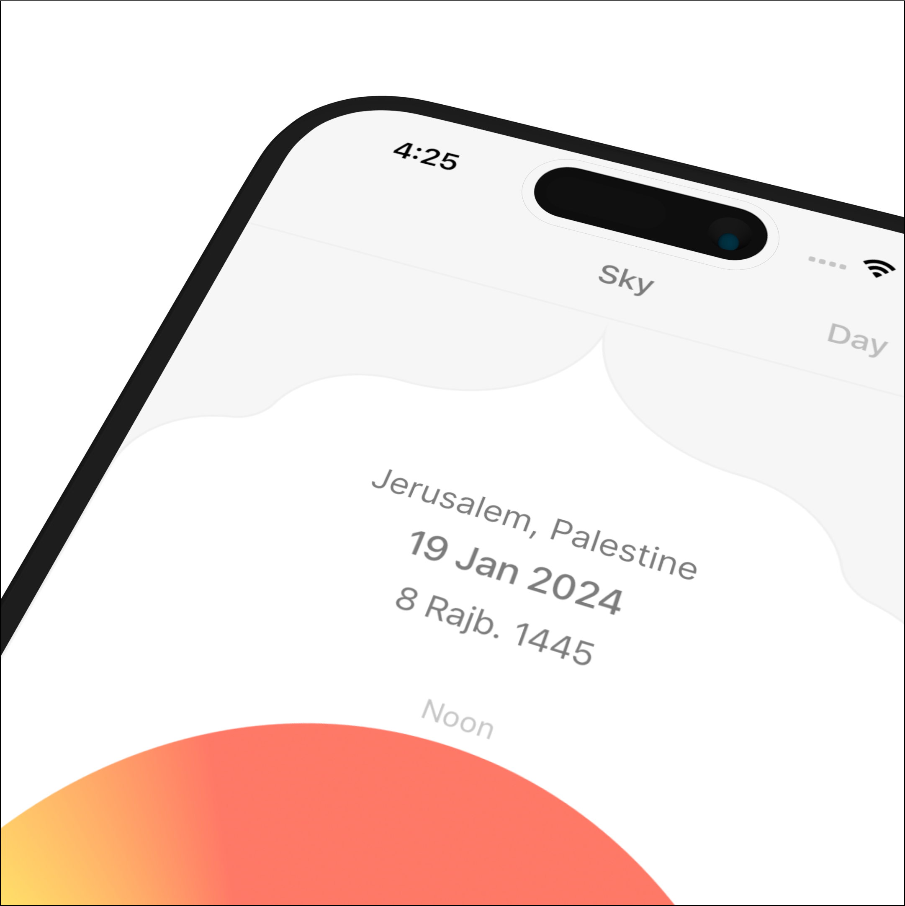
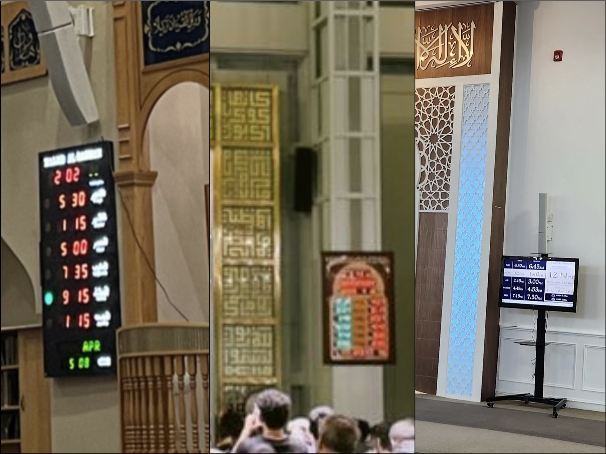
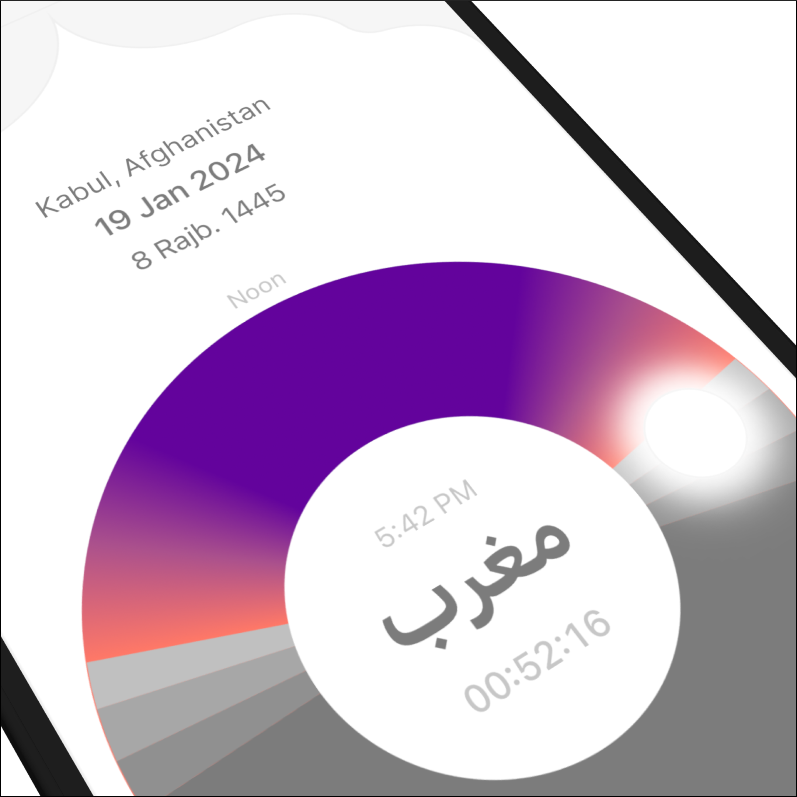
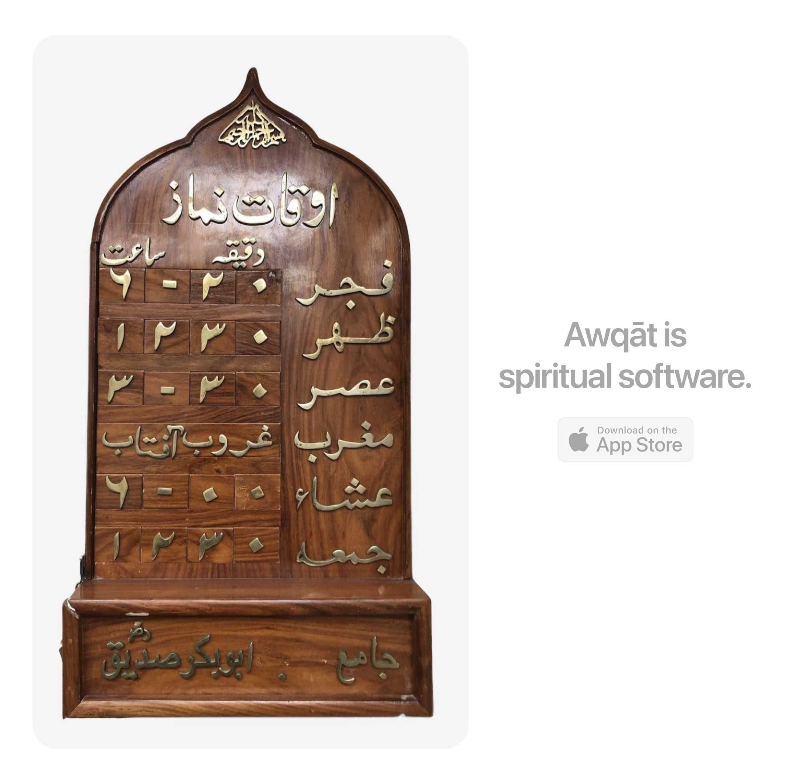
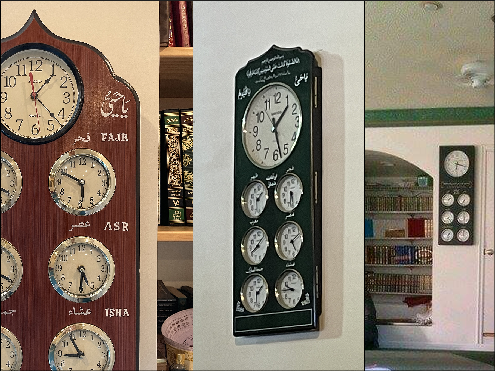
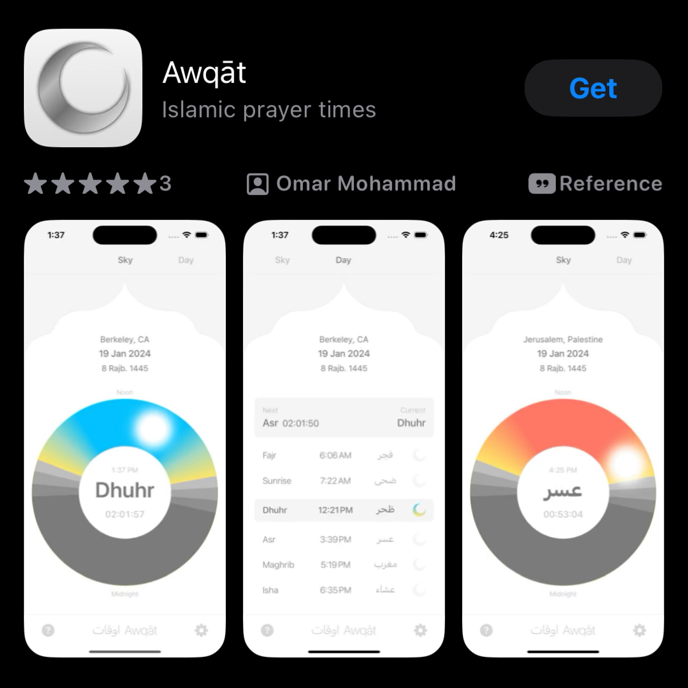

## اوقات Awqāt (ow-kawt)
The most beautiful Islamic prayer time app on the app store.

[Download →](https://apps.apple.com/us/app/awq%C4%81t/id6461305834)

<video controls autoplay muted loop style="border: 1px solid black;">
  <source src="/videos/3.mov" type="video/mp4" />
</video>

اوقات Awqāt

 

 

 

 

 

 

**Berkeley, January 2024** 
