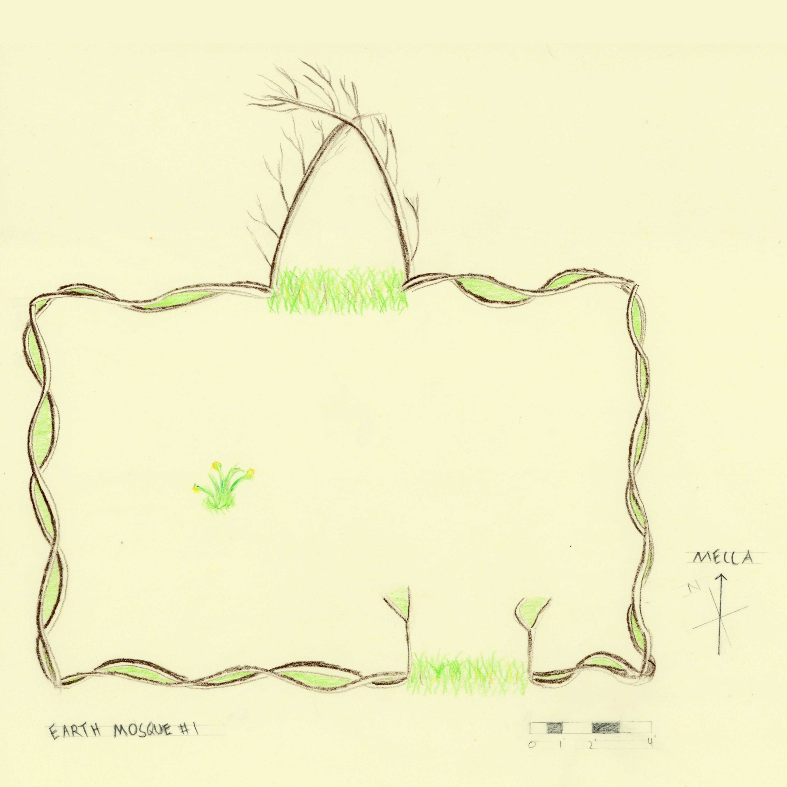
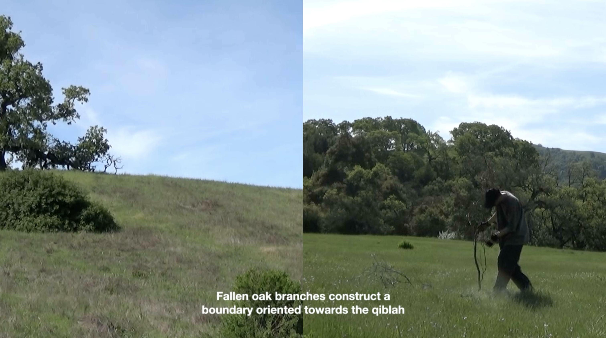
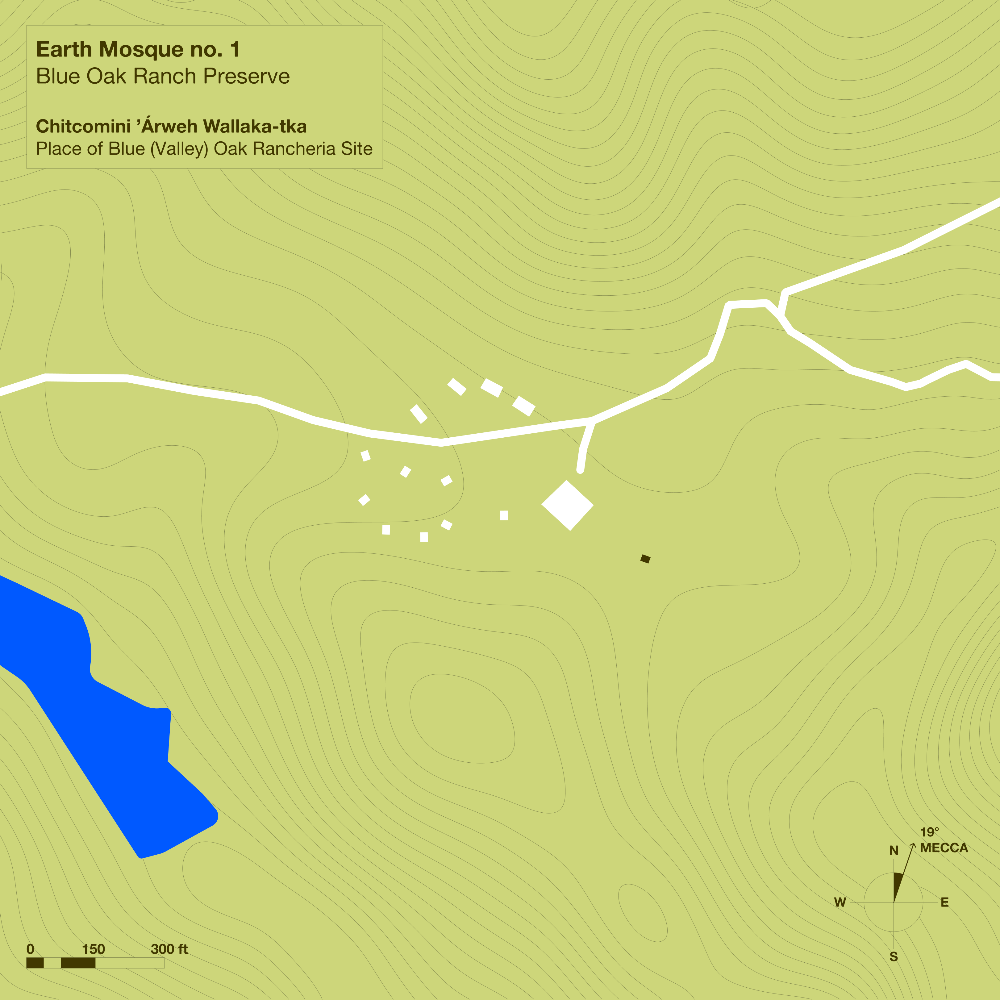
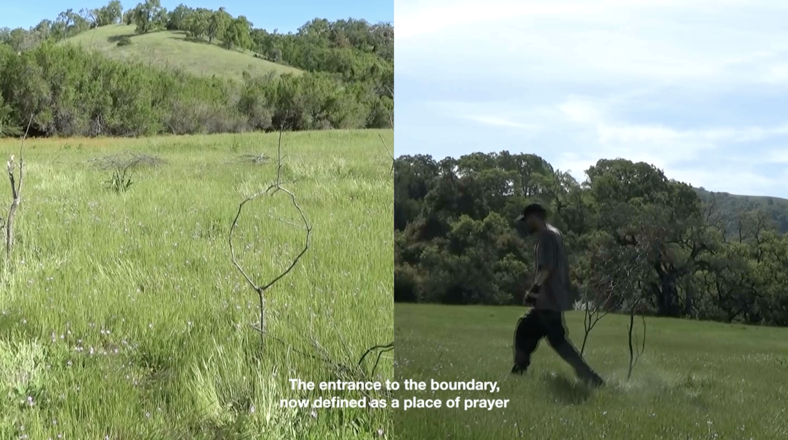
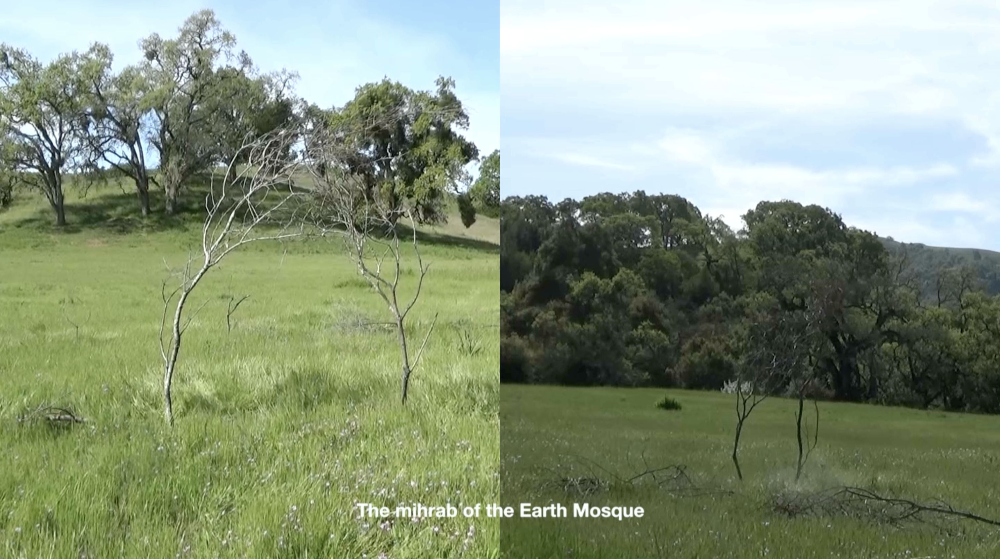
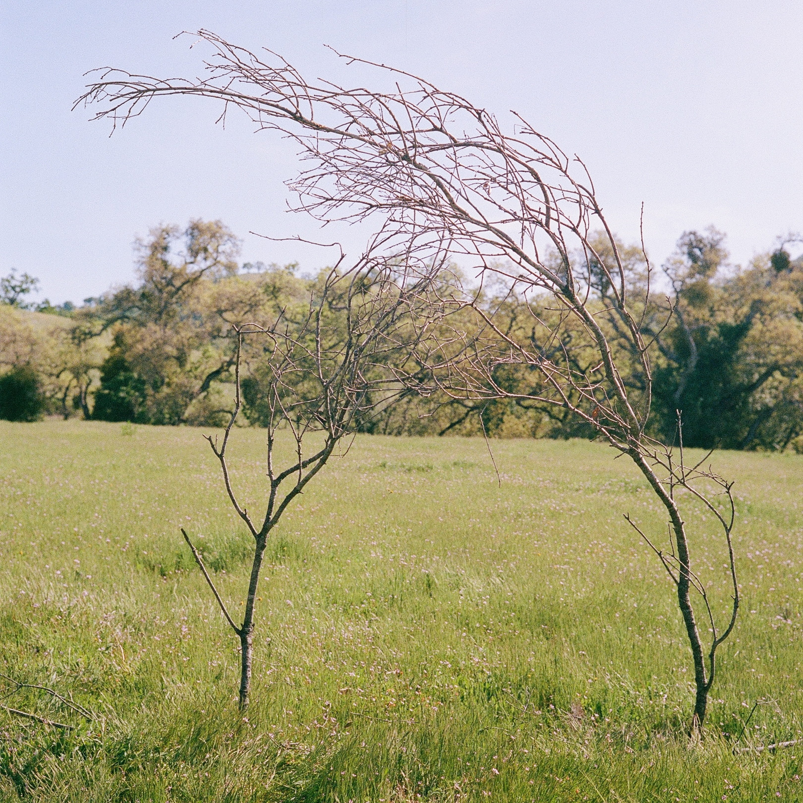

# Earth Mosque no. 1: Blue Oak Ranch Preserve

<iframe 
  width="auto" 
  height="380" 
  src="https://www.youtube.com/embed/QYM3-LQUHWc?si=McgTrrewMPYqiDpV" 
  title="Earth Mosque no. 1 04 min 41 sec" 
  frameborder="0" 
  allow="accelerometer; autoplay; clipboard-write; encrypted-media; gyroscope; picture-in-picture" 
  allowfullscreen
/>
\

