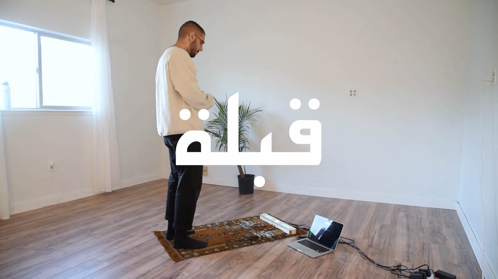
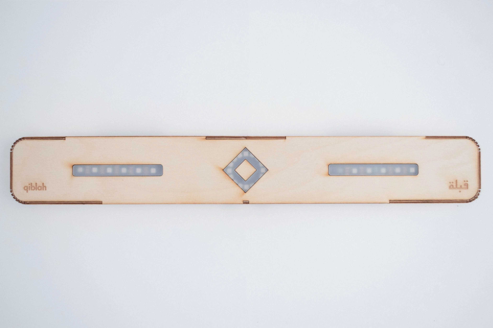
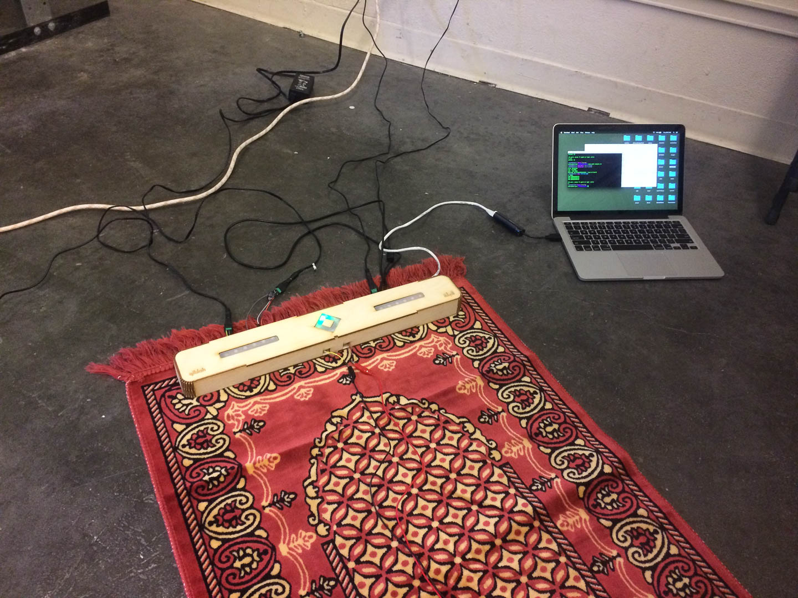
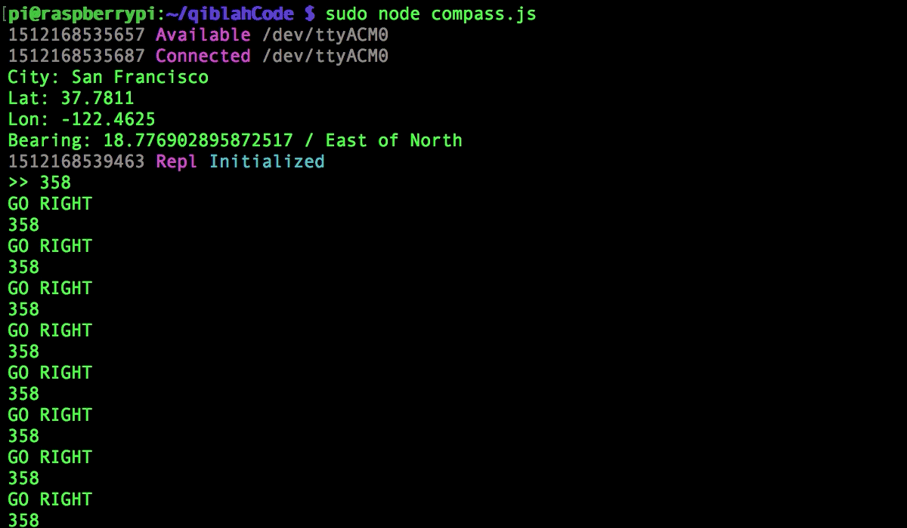
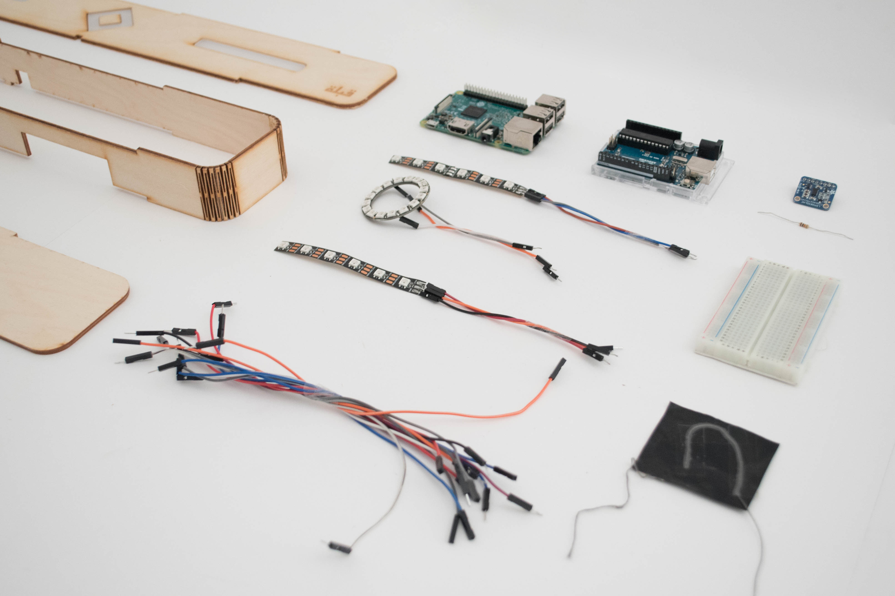
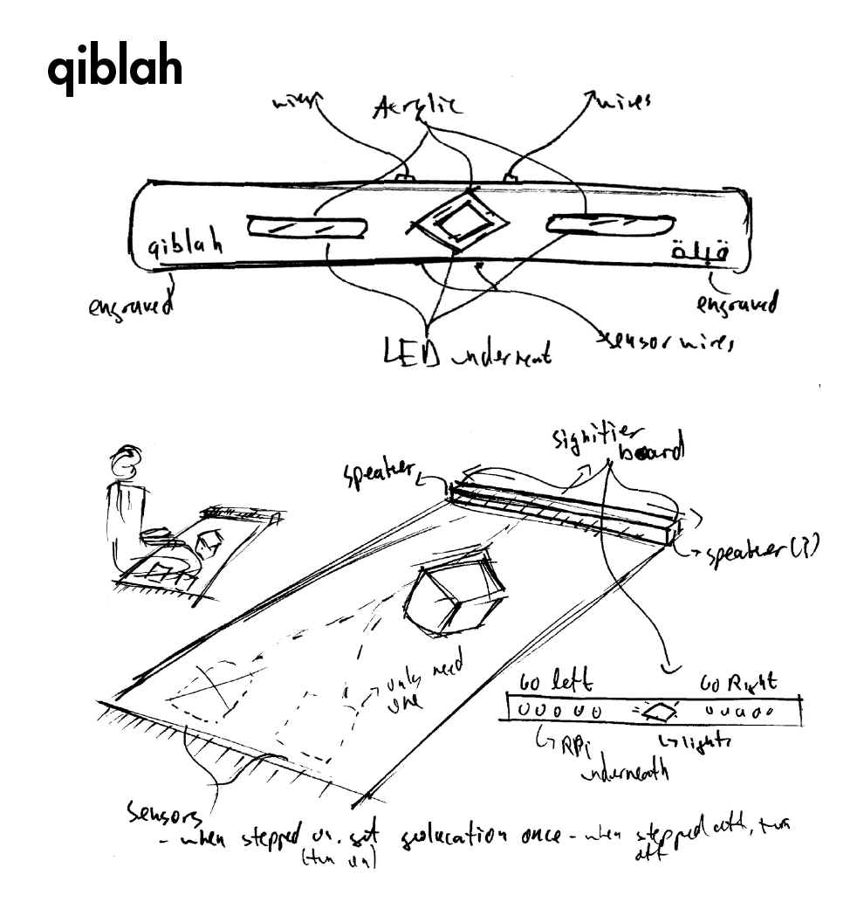

# قبلة Qiblah

<video autoplay controls muted loop style="border: 1px solid black;">
  <source src="/videos/qiblah-004.mp4" type="video/mp4" />
</video>

Demo

Qiblah is a speculative prototype object that explores anti-interface technology. The qiblah is the direction facing the Ka'aba, the direction Muslims face while praying. Today many smart phone apps are responsible for guiding Muslims towards the correct qiblah. However, Qiblah was designed as an analog alternative, enabling holy spaces to be untouched by the distractions of technology.

{/*  */}

