# SFOIC: The Interstitial Mosque (American Mosque no.1)

<iframe 
  width="auto" 
  height="359" 
  src="https://www.youtube.com/embed/DdYd9BdXtTE?si=uR-lZ_PvlfRXs-y3" 
  title="SFOIC: The Interstitial Mosque (American Mosque no.1)" 
  frameborder="0" 
  allow="accelerometer; autoplay; clipboard-write; encrypted-media; gyroscope; picture-in-picture" 
  allowfullscreen
/>
\
The San Francisco International Airport was officially built in 1927. By 1966, major masterplans had been proposed by multiple firms, resulting in the circular five story parking structure being completed in 1981 by the local Bay Area firm Dreyfuss+Blackford.[^1]

Originally planned as a landscaped courtyard, the opening of the parking structure currently exists as a queuing station for taxis. As a majority of taxi drivers who work the airport circuit are Muslim, the queue has become a dedicated space to realize the 5 daily prayers.

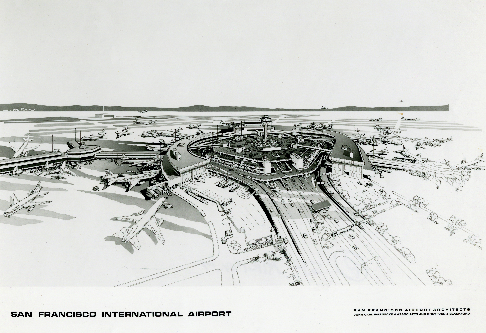

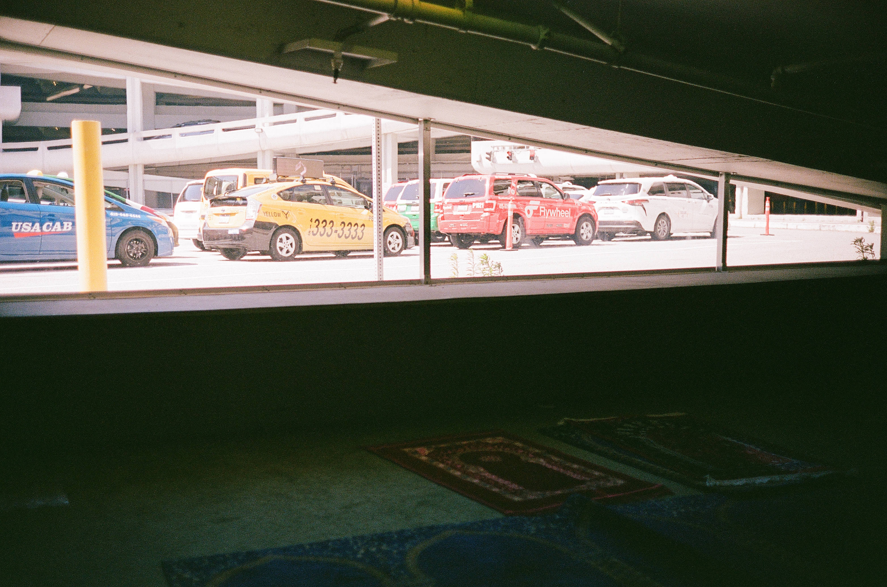

### Wudu Station

By 2013 taxi drivers partnered with SFO management to install a wudu station, two faucets and a bench, in order to perform ritual purification before prayers.[^2]  This wudu station was installed in an opening directly under the inclined ramp leading to the second floor. 

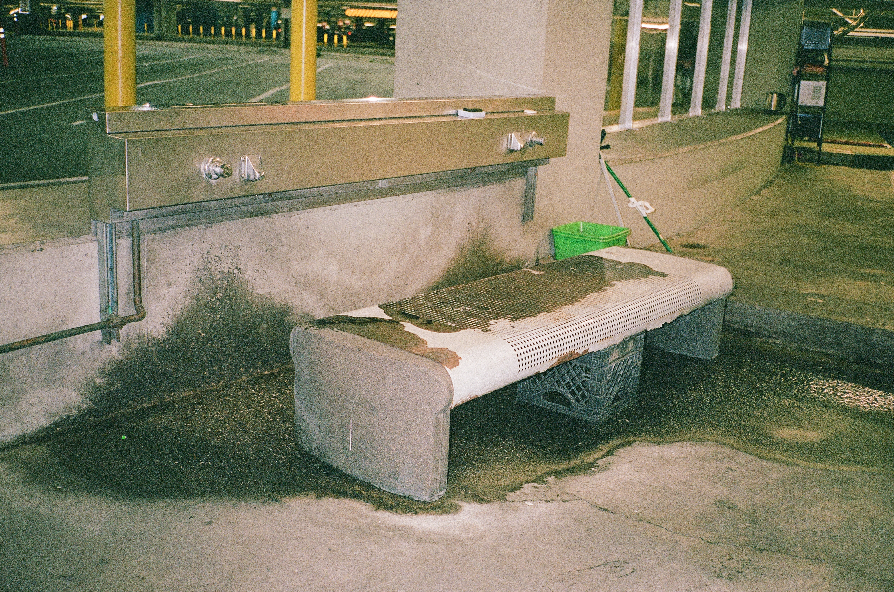

This space is not only used for prayer, but also as a “break room” for all members of the taxi driving community, muslim or not. Microwaves and tea kettles provide a “kitchen” space for all to share and use, while the carpet and chairs provide space to take prolonged breaks. The communal space provides a backdrop for the drivers to engage with one another, share stories and laughs, and to simply hang out during slower periods of work. Not unlike mosques across America, this space places the community first, independent of religion and background. The wudu station eventually transformed this otherwise “useless” space into a piece of interstitial architecture: an interstitial mosque. 

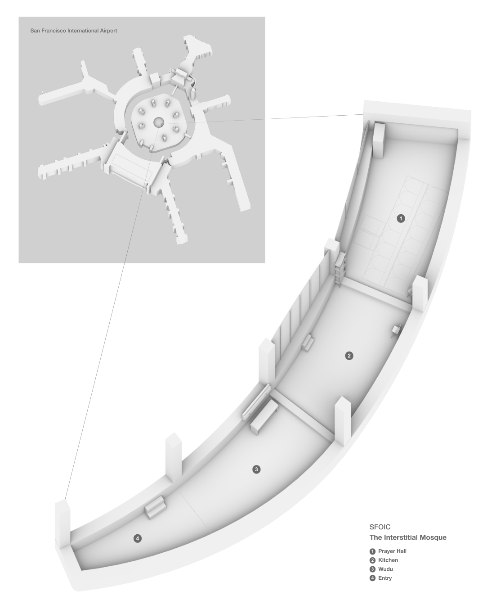

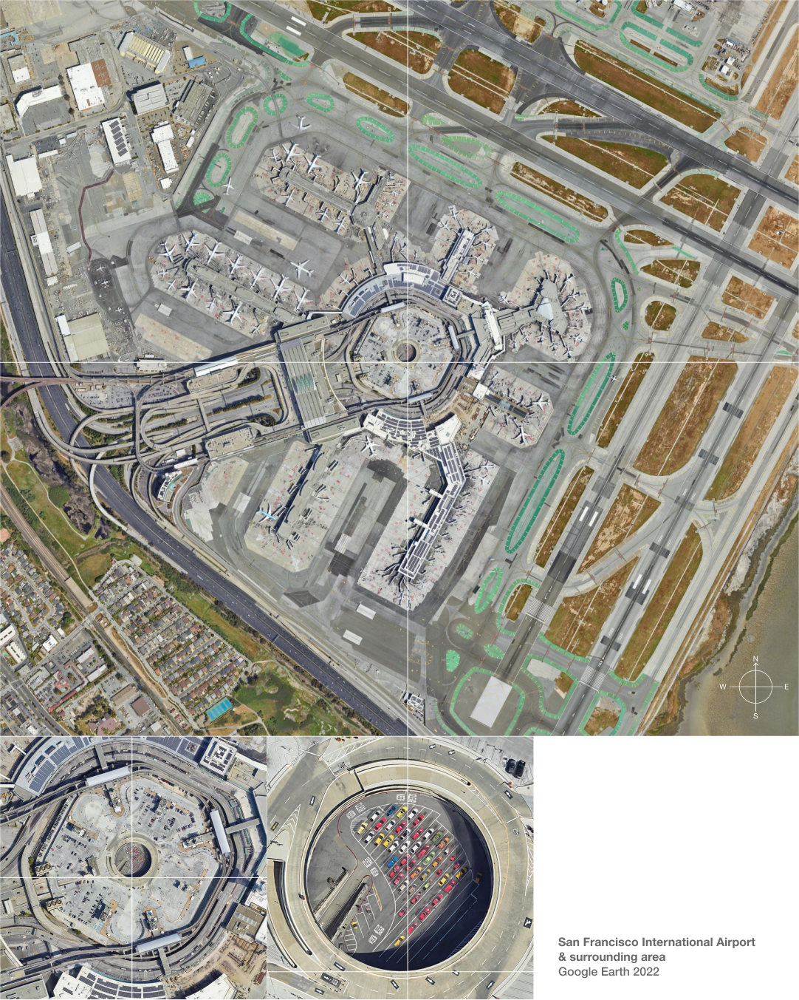

### Qiblah

The muslim possesses a unique metaphysical attribute, one with which they can make any “place” a mosque; all that is required is their presence and a specific orientation towards the qibla. 

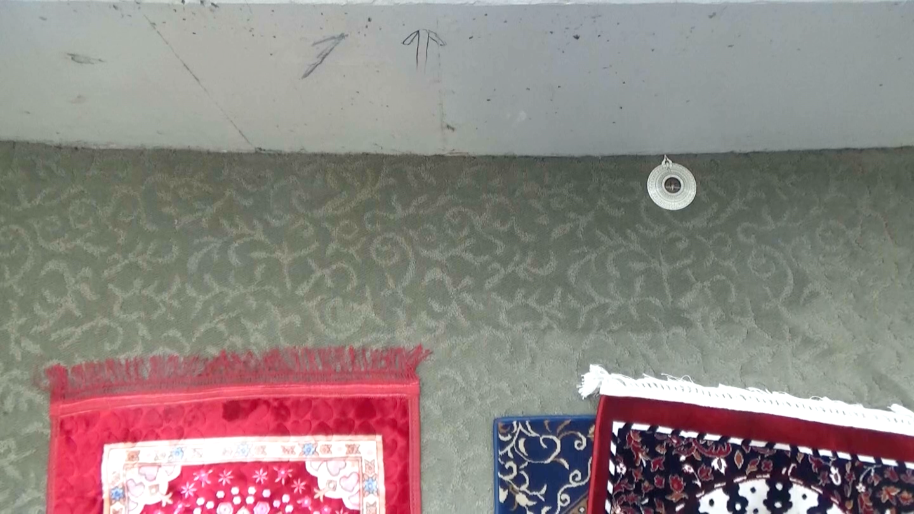

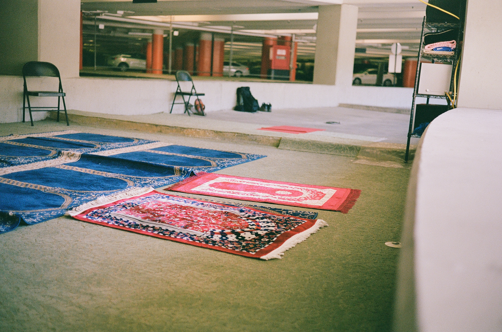

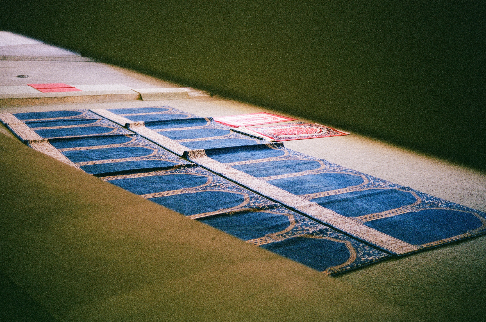

### Interstitial Architecture

Muslims pray in interstitial spaces quite frequently, as these spaces tend to be the most private in public environments. Often near emergency exit spaces, “do not enter” doorways, and lesser traveled stairways, makeshift qibla walls and mihrabs act as the buffer zone between the place of prostration and the physical world. The Prophet Mohammad, peace be upon him has said that “The entire earth has been made a place of prayer...”. The Muslim lives by this statement, laying down a prayer rug wherever they must. To this extent, anywhere, and anything, can be a mosque, a musalla, an Islamic center; the constraints are that there are none. 

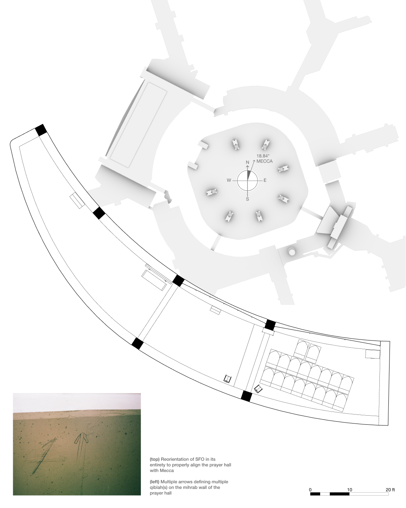

The American mosque has traditionally been an architecture of adaptive reuse, where homes, office buildings, and churches are modified to become mosques. These modifications range from the additions of traditional mosque elements such as domes and minarets, the renovation of bathrooms into wudu specific washrooms, and most importantly spatially orienting a large space to be aligned with the qibla for prayer. 

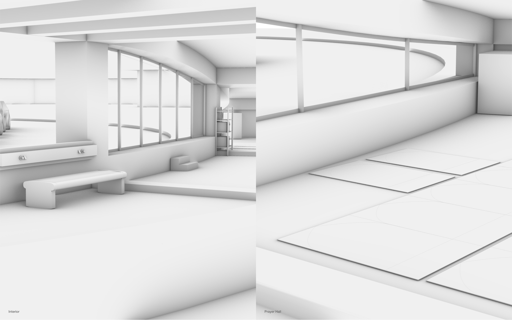  
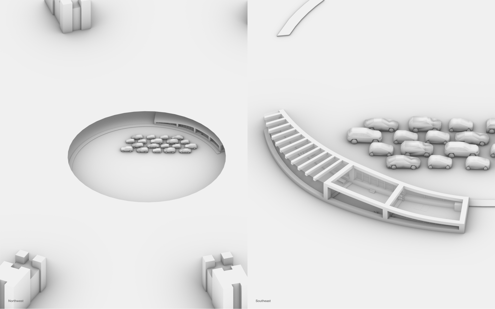

As the urban fabric of Bay Area society evolves, perhaps over time the San Francisco International Airport will be replaced by another transportation hub. As the Muslim population of the Bay Area continues to grow, in 100, 200, 300 years, could SFO become the site of a grand mosque, accommodating the entire Bay Area Muslim community?

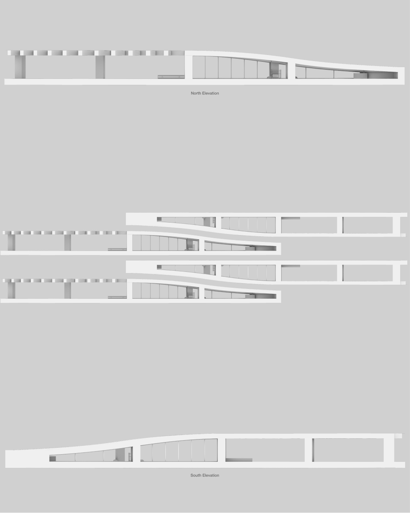

### SFO as Mosque

If you look closely at the parking structure and its surroundings, SFO possesses many elements that when assembled together, create a pre-defined mosque architecture. A central courtyard acts as a main source of light for the covered sections of the structure, but also as a portal to the heavens, a claim of the sky above and the earth below. The Air Traffic Control Tower replicates the minaret. A potential future caller of the five prayer times.

The Islamic prayer space located in the central parking structure of SFO is a testament to the creative resilience of place-making the American muslim community possesses.

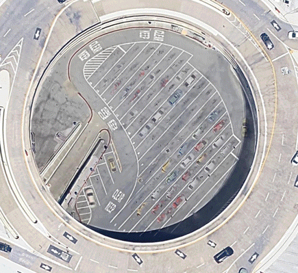

SFOIC, The Interstitial Mosque: American Mosque No. 1 is a research project conducted by CAMEL concerning the architecture of the mosque and Islamic environments in the US. 

**San Francisco, September 2025**  

---
` `
[^1]: *San Francisco International Airport Parking Structure - Dreyfuss + Blackford Architecture.* Dreyfuss + Blackford Architecture, 22 Aug. 2022, www.dreyfussblackford.com/project/san-francisco-international-airport-parking-structure/. Accessed 13 Sept. 2025.
[^2]: Matier, Phillip. *SFO Provides Cabbies with Wash Station.* SFGATE, 9 June 2013, www.sfgate.com/bayarea/matier-ross/article/sfo-provides-cabbies-with-wash-station-4589294.php. Accessed 13 Sept. 2025.

